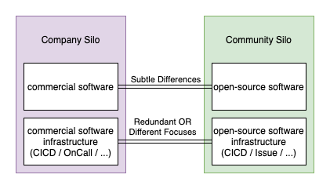
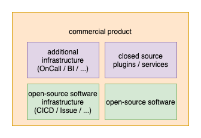

今天要讲的话题是我在不同场合下提及过这个概念多次的话题。Two Hats of Developers 即**开源社区的 contributor 在参与过程中拥有多重身份，既是开源社区当中的志愿者，又是商业公司的员工或自由职业者等等**。这个观点对如何运行一个开源社区的方方面面都有深远的影响。

可以说，这个概念在我的脑海中有着很丰富的含义，以至于此前一直无法用简单的文字描述出来。近几天反思 KPI 导向的衡量指标带来的种种问题的时候突然找到了灵感。

以下正文。

## 开源项目和商业公司

在讨论如何衡量开源社区的指标之前，我们需要了解[开源项目和商业公司之间的关系](https://github.com/flossway/flossway/discussions/2)。因为大部分 KPI 导向的衡量指标，实际上指的是商业公司里的员工被摊派的指标。

今天，不少新兴的科技公司声称自己是“开源技术公司”，并创造了“主导公司”“背后的商业公司”和“社区用户”等等词汇。我要讲的开源项目和商业公司的关系，就是和这类公司之间的关系。

开源社区通用的行为准则之一是“赢得权威”，即 contributor 通过 contribution 创造价值赢得其他社区成员的信任和尊重，积累社会资本，而不是通过在商业公司当中的地位获得权力。开源社区的公平性是基于 contribution 赢得权威的精英领导制。因此强调社区当中有一家“主导公司”进而暗示这家公司及其雇员的主导地位是荒唐的。

Contributor 可以通过自己的 contribution 积累社会资本，公司也可以通过公司层面的 contribution 来赢得声望，包括主办社区活动，支持员工参与社区，赞助社区日常支出等等。社区成员都会知道哪家公司为社区的发展做出了重大贡献。公司的这种 soft influence 在[夜天之书 #5](yatennosyo-0005.md)当中也有介绍。

然而，近年来不少打着“开源技术公司”名号的企业，却在 open-source 的旗帜下行 source available 专有软件之实。在上一篇文章[夜天之书 #28 What is Open Source](what-is-open-source.md) 当中提到

> Contribute 这些项目，并不能保证自己的努力始终以开源的形式存在，乃至于自己都不能享受到自己努力工作带来的改善。这种源码可得的专有软件的开发模式，实际上仍未摆脱一个组织一家公司雇一拨人写一个软件本身就是产品拿来盈利的思路。随着 contributor 逐渐发现这类软件协议上的不平等以及时不时出现的改换协议的案例，最终源码可得的专有软件会像传统专有软件一样无法获得开源协同带来的生产力提升。

这都不是要求 Copyleft 式的自由软件保证，而是 contribute 这个项目本身就是可疑的。ASF 项目的 contribution 你不用担心你拿不到自己做的工作，顶多别人拿去商用。这种 source available 的专有软件你做了工作又被 CLA 掠夺了权利，自己使用都要受到种种限制。

在讨论开源项目和商业公司应该有的关系之前，我们先来看由于项目和公司定位杂糅带来的问题。

**核心问题在于开源项目的天性与商业公司的需求的割裂。**

这看起来有些不可思议，明明是把项目和公司定位杂糅了，为什么问题却是两者之间的割裂呢？其实这也不奇怪，因为开源项目和商业公司天生有着不同的关注点，强行糅合在一起，会出现的自然是相互排斥带来的割裂。

这种割裂的典型特征就是商业公司为了保证绝对的控制，在开源项目的开发流水线以外，搭建了“主导公司”控制的第二流水线，并逐渐控制不住第二流水线对开源流水线的侵袭。

我们来看两个例子。

**第一个是经典问题“应该在开源社区上投入多少时间”**。这可以说是当下“大厂开源”背景下，被摊派指标的员工被问得最痛苦的问题了。导致这个问题的根源，就是存在第二流水线。

不管是否实践开源项目当中公平参与的原则，哪怕是 GitHub 等形式的托管，都足以挑动商业公司遵循传统控制理论指导下的神经。换句话说，只要做到“开放源代码”这个基本动作，许多商业公司就快受不了了。为什么不是公司内可见？读写权限管控呢？依赖库有没有经过安全专家审计？如果 A/B/C/D/E 情况发生，如何保证公司的利益？

这样的担忧下，基于 GitHub Issue + Pull Request 或其他形式的开发流水线就会被排斥。要么彻底弃用，就做镜像代码仓库，倒也是彻头彻尾的 source available 专有软件。但是商业公司又想蹭个开源的热度，就会保留一些入口。同时出于上面提到控制论作祟，这个开源流水线是受到歧视的，商业公司必然会在“内部”搭建起第二流水线。

如上图所示，community 部分有一套流水线，company 部分也有一套流水线。软件代码很相似，但又略微有所不同，稍有经验的程序员都知道这种情况下不同版本出现的问题定位调试起来是最折磨的。另外持续集成等流水线要么是重复的，要么有不同关注点。community 部分关注的是社区成员之间的协同和项目的质量，company 部分关注的是产品的应用和线上问题。

这两套流水线很容易产生冗余和不同关注点相互侵入。要么是保障软件质量的测试套件和测试样例一直纠结到底应该放在哪，重复实现的持续集成逻辑，经典问题“测试要开放给社区吗”。要么是 OnCall 乃至公司绩效指标相关的统计信息侵入到 community 当中，强行添加只有商业公司关心的 label 等等。

推崇敏捷开发的同学也许注意到我用 silo 来描述这种模式，community 一个职能竖井，company 一个职能竖井。这种情况下指望两个实体之间互相提供价值是不切实际的。而这，却是当下大部分商业公司的做法，成立一个“社区部门”，一锅乱炖把用户社区、应用开发者社区和内核开发者社区全都丢给这个孤立无援的团队。实际上，一个开源项目真正要在这几点上都取得成功，所面临的的挑战不亚于经营一家创业公司，而传统的管理者仍然认为这是几个工程师或者加上运营人员就能搞定的问题。

应对这个问题的方法并不复杂。Community 应该是一个横向基石的概念，而非纵向的职能竖井。商业公司的产品应该基于开源软件设计生产，而非软件本身就是产品。这样，商业公司的员工开发产品时依赖开源软件，对其修改贡献回上游也即参与开源项目，因此同时也是开源项目社区的贡献者。

如上图所示，在这个结构下，commercial 部分只做商业必须的流水线，同时该作为专有软件开发的插件或服务作为专有软件开发。“应该在社区上投入多少时间”的问题也不攻自破，因为根本不需要额外在“社区上投入时间”，你的产品就是基于开源项目做的，遇到问题该投入时间就投入时间。同时，community 也成为整个产品线上的员工都会关注的实体，而不是单靠一个“社区部门”大声疾呼。

**第二个例子是流程管控**。这一点在上面的例子里也有所提及，我们以一个具体的例子展开。

开源社区当中需要适当的流程来帮助 contributor 创造价值。如何加入这个社区，如何提交贡献，如何合作和处理冲突，这些信息对于 contributor 来说都是有益的。然而，社区当中的流程只有简单才能持久，流程应当是从社区成员的共识中归纳出来的，绝不会是预设空想的流程管控。

“主导公司”很容易在公司之内形成一个产品经理、项目经理和开发者的开发结构。要求任何需求的开发都经过经理乃至公司之内的某种委员会评审之后才能实施。一旦加上这种规矩，如果公司还把持着开源社区实际上的控制权，一个自然而然的可怕念头就诞生了，**“外部贡献者”也应该遵守相同的流程**。否则，经理和委员会及其代表的商业公司就会感受到强烈的冲击，认定“外部贡献者”是失控的，是有毒的。

这是完全错误的想法。

开源社区当中任何 contributor 都是公平的参与，遵守 **earn authority by contribution, not by position** 的原则。反观这些经理和委员会成员，在商业公司中往往从未参与过 community 的任何活动，甚至都没露过面，毫无 contribution 可言，仅仅按照传统的控制理论以 position 强行占有权力发号施令。其发号施令的对象不过是兼具公司员工身份的社区成员，但却因为数量的优势造成了实际的影响。

这在信奉控制轮的组织中看似有道理，过去的几十年间也都是这样运作的。但是开源软件社区是跨越组织边界的协同支撑起来的，contributor 不会买商业公司的账。我凭着自己的技术实力做出 contribution 努力改善软件，为什么要向你这家商业公司里一个没有 contribution 的管理人员汇报？我给你打白工？这种冲突愈发加剧了管理人员的危机感，再次认定“外部贡献者”是失控的，是有毒的。

另一方面，我曾在一个分享上提过，contributor 能够开始 contribute 开源软件，尤其是持之以恒地创造价值，其核心动力来自于对项目愿景、技术能力和社区人际关系的认可，是完全自驱全力以赴的。这跟打工人的思路是不一样的。因此 contributor 有更强的动力去遵守简单有效的流程，哪怕商业公司的打工人觉得这跟我的本职工作无关，好麻烦啊不如直接提交代码算了别的都毁灭吧。因此 contributor 有更强的动力去推动 contribution 落地，虽然不愿意向一个莫名的管理人员汇报，不愿意被奇怪的时间排期限制（当然，项目层面的 code freeze 是可以理解的），哪怕商业公司的打工人认为能不做就不做，混一天是一天。

这并不是说商业公司的员工都是打工人，我只是在对比两种不同的心态。实际上，根据[《企业的人性面》](https://book.douban.com/subject/27125968/)等著作中的论述，打工人心态并不是本性，而是出于管理者的假设。

> 采用 X 理论的观点，就免不了会重视各项控制的技巧，包括以下步骤和方法：告诉人们该做什么、确定人们是否在做，以及给予奖励和惩罚，等等。由于 X 理论的假设是人只有被指使才会为组织的成功效力，因此我们会很自然地关注指挥和控制的技巧。
> 
> 与此相比，Y 理论更关注“关系的特征”，期待由此建立一种环境，鼓励我们对组织目标作出承诺；同时也提供机会，使我们发挥最大的主动性、天赋以及自我指导力等，以达到组织的目标。
>
> 最重要的是，Y理论的假设说明了一个事实：组织中，人们互相合作的限制并非来自人类本性，而是源于管理方法不当，不知道该如何充分利用人力资源的潜力。X理论为管理者提供了很好的理由，可以解释组织绩效低下的原因，即人类本性所致。而Y理论则将问题归于管理本身：如果员工表现懒散、态度冷漠、进避责任、拒绝合作、缺乏创新，那一定是因为管理者没有采取适当的组织与控制方法。

在强个体的价值崛起的今天，如果不能了解新的组织认知方式，在组织中激发人的自我指导和自我激励，那么组织一定是失败的。只不过在商业公司当中员工或许只会沉默地对抗，而开源项目当中 contributor 会直接质疑或用脚投票。

从敏捷宣言的角度来说，**个体和互动高于流程和工具**这个原则也是反对流程管控的理论依据。可以说，开源的理念和敏捷的理念在软件开发的认识上是相通的。

两个例子讲完，我们抛出开源项目和商业公司应有的关系的结论。其实在上面的讨论中已经蕴含了这个结论，那就是**开源项目和商业公司是两个独立的实体，商业公司基于开源软件构建起自己的商业产品或服务，并持续投入回馈开源社区。**

抛开上面字里行间讲过的原因，我们来聊聊要做到这一点的方法。我们需要刻意地分开开源项目和商业公司，这是因为大环境下控制论的力量太过强大，一旦定位不清有所重合，第二流水线侵入开源流水线，以及社区成员对开源项目和商业公司之间的差异的模糊化认知都不可避免。比如，提起 MongoDB 和 ElasticSearch 这两个项目，你是不是只能想到同名的产品和公司？

要想分开开源项目和商业公司，可以从以下三点入手。

**第一点是起一个不同的名字**，千万不要图简单对着 Xxx 项目起一个 XxxLabs 的公司名。这其实已经暴露了你的思维惯性命中了上面大部分的坏例子，并且公司员工一定分不清开源项目和商业公司。客观上存在不会参与开源项目的公司员工，对外宣称自己是 XxxLabs 的人，也会引起社区成员的混乱。XxxLabs 的财务人员跟我这个 Xxx 项目的 contributor 为什么会共享同一个组织名字？归属感在这种情况下非常难以建立。

**第二点是避免商业公司攫取过度的权力**，包括上面讲到的第二流水线入侵，流程管控限制，以及潜在的修改协议的威胁。如果将开源项目从一开始就以独立项目的形式运行，license 选择正确，阻止暗藏杀机的 CLA 落地，在多样化的社区力量发展之后，商业公司也就无法攫取过度的权力了。

**第三点是商业公司应该 fork 独立项目，以独立项目为上游，归属商业公司的 fork 为下游**。即使对于可被认知为在项目层面，而非商业产品特有的变化，员工作为 contributor 可以直接在上游开源项目开发，但是这种存在一个下游商业公司 fork 的模式，将很大程度保护商业压力和客户需求侵入到上游开源社区。

比如 Apache Pulsar 项目，StreamNative 公司就制作了一个公司层面的 fork 并以 mirror issue 等形式建立起商业公司关注的内容的一个在开源项目信息之上的视图。

商业公司必须为客户提供价值，因此产品或服务的 hotfix 和 hacking 不可避免。但是如果像某些公司一样产品即软件，那么这种需求就会变成必须往开源项目倾倒服务于“主导公司”的客户，但是从开源项目本身看无意义，或者不够好的变更。如果是一个公平的 earn authority by contribution 的社区，这种提案很容易通不过，或者延期。于是商业公司又判断“外部贡献者”是失控的，是有毒的，必须建立起一套控制机制来贯彻自己的商业利益。

反过来看，如果有一个下游商业公司 fork 来缓冲这些需求，紧急处理之后再思考如何 contributing back 等等，就变成一个经过研究的 upstream first 原则的理解和落实的问题。不需要创造出一个新的问题来解决，甚至根本就是无解。

区分开了开源项目和商业公司，杂糅项目和产品以及公司的 KPI 指标也就没了意义。我们从 2C 运营模式和开发者社区的传统 KPI 指标两个方面切入，讨论衡量开源社区的指标的误区和应该如何做。

## 2C 运营模式

2C 运营模式即面向消费者的运营模式，这里指的是在“社区运营”这个概念火起来以后，装在这个袋子里泥沙俱下的运营人员的实践。

2C 运营模式一脉相承自当年遍地黄金如今增长缓慢的消费者市场营销，其基本假设是运营对象都是傻瓜（无贬义，即对人的智能的最少假设），通过直接利益交换营销指标，尤其是人头数，点击数一类的氛围型指标。换句话说，搞出气氛，数字好看就算成功。

这种模式下典型的两个案例是**集赞**和**捉虫计划**。

前一个例子不展开了，很典型的是把运营对象当成傻瓜，凑人头刷一个数据搞气氛，其实做出来的数字跟社区当中创造价值毫无关联。近期有不少文章分析过，例如[别逗了，同学！开源不是点赞送礼](https://mp.weixin.qq.com/s/e1ygq97TkopFZoA4IwxqRg)。

后一个例子其实就是故意留 BUG 凑人头“修复”。而且还是那种加个 linter 写个脚本就能持续集成解掉的问题。为了运营，就不这么干了。而是刻意留下几个没写过代码的人也能照猫画虎搞个“贡献”的坑，看见了也不去修，就等着交给运营人员去“放虫”，甚至我亲自写低级 BUG 给人修。

这种活动真的异常尴尬，不要解释是为了降低门槛还是鼓励参与，开源软件社区的目的是制造出好的软件，不是闹哄哄的来一堆人假模假样的“参与”。如果为了运营能背弃软件工程的最佳实践，那么毫无疑问这是为了运营而运营。这样吸引来的 contributor 也不会是真正有热情参与 community 的，而大概率是干一票跑路的投机者。

关注开源软件的开发者群体基本是完全看不起这种混一个 PR 换一个马克杯或者某种周边的公司的。如此运营，恐怕还有负面效果。唱赞歌的人也不过是为了忽悠运营接着撒币罢了。

我在 COSCon'21 的主题[《Why Contributors Stay and Grow》](https://www.bilibili.com/video/BV1Tg411K7KS/)上提到过 2C 运营模式的运用姿势。这是一种调动 contributor 直接激励的参与动机的手段。

类似 GSoC 或 Hacktoberfest 这种活动，在不侵入项目正常开发的情况下，鼓励参与者投入到开源软件社区正常的价值创造中。活动只是提供了一个引子连接起新成员与其他社区成员的关系。这种通过直接激励引导入门，在参与和价值创造中积累起社会资本并逐渐深入的模式，对社区是有益的。尽管我还是认为活动的数量应该控制，一旦不加控制势必引来投机者。

这种好的直接激励模式和上面提到的 PR 或 star 换周边的根本区别就在于动机和行为。好的直接激励是以社区的价值创造为本，活动用于加速及支持这个过程。投机的方式从活动参与者，到运营人员，到被迫参与的此时不戴社区成员的帽子的公司员工，都是为了这个利益交换而行动，彼此看不起还要假装融洽相处。一旦利益交换完成，关系立即分崩离析。不是说结果都是 contribute 了，吸引到人来了就是好的。这种动机的差别会营造出截然不同的社区氛围，身处其中的人能够明显的感觉到其中的差别，并在诸多细节上体现出来。

总结来说，2C 运营模式在 2D (developer) 的环境下，只能以直接激励的模式落实，并且在实践中需要恪守辅助的角色，不应该喧宾夺主。新成员进入社区后，需要强大的社区引力吸引他到某个领域继续深入。当然，也有老成员参与活动的情况，只是因为活动本身基于开源社区正常的价值创造过程，这并不需要额外注意。最后，2C 运营模式下的直接激励一般价值不高，不应该过度包装，否则会掉进低估 contribution 的陷阱，起反作用。对这种模式能够为社区发展创造的价值，也不用抱太大希望。

2C 运营模式我实际上并没有做深入的研究，但是其显而易见的问题太多，也是近期的“引爆点”，所以单独讨论一小段。

## 传统 KPI 指标

摊派到开发人员头上的传统 KPI 指标的问题，一言以蔽之，是**没有理解组织想在开源项目社区当中寻求什么**。

我们先看几个典型的传统 KPI 指标。

* Contributor 人数
* Committer 人数
* Feature 数量
* 从基金会孵化/毕业

Contributor 人数这个指标的典型错误是线性思维，这个季度 200 人，下个季度 500 人，明年 1000 人，甚至直接来个十倍增长计划。这个线性思维的底层逻辑是 contributor 是标准化资源，直接进行一个小学算术乘法就能够增长上去。

当商业公司的开发人员被摊派了这样的 KPI 之后，他必然会做的是简单解释 contributor 的意义，然后通过真正能够标准化的手段来落实。典型地，定义成单次活动，包括创建 PR 或 issue 或 review 以及经典的 star 本仓库。于是转入上一段中提到的 2C 运营模式，开始凑人头。

Committer 人数这个指标看起来要高端一点，但是本质上还是线性思维，这个季度新增 5 个，哦，还要来自“外部”哦，下个季度新增 10 个，如此递增甚至加速递增，不然怎么能表现出你的社区在增长呢？

当商业公司的开发人员被摊派了这样的 KPI 之后，他必然会做的是降低 committer 的标准，求爷爷告奶奶地跪舔偶然出现的 contributor 来配合演出，甚至自己先完成 contribution 的内容再签上别人的名字，再按照被降低的标准立刻提名完成指标。

如果是个健康的多元化社区，这种降准的行为不被不同背景的维护者所接受，将无法推行。如果能够推行，其实已经是公司的意志侵入到社区的体现了。前文讲过，这种控制论在 community 当中是行不通的。优秀资深的参与者会唾弃这种行为，将这样做的人驱逐出去。如果没有这样的力量，那么他们会自行离开。

进而，这种指标吸引来的又是投机的人。反正你是那个被 KPI 压得喘不过气的人，我开恩来配合你演戏，你把 contribution 和 title 都准备好，我出个“外部”人头。这样的氛围下商业公司的开发人员，一方面不得不求着这些投机客帮忙解决指标，另一方面又发自内心的瞧不起这帮人，“协作”气氛是非常诡异的。Community 当中期待的富有责任心，积极进取能力强劲的 committer 群体被腐化，从而商业公司进一步坚定了“外部贡献者”是低能的，是有毒的，另外创建一个公司内部的小团体来掌控社区。Committer 反而成了大家都避之不及的头衔。这种就是典型的**道在迩而求诸远，事在易而求诸难**。

Feature 数量这个指标看起来应该靠谱一些了吧？毕竟不用再凑人头了，而是实实在在的看社区创造的价值本身。其实也不然。只要数字本身就是结果，数字背后没有假设，再加上一点线性思维的推波助澜，所有这类指标都会变成一场闹剧。Feature 数量有两个致命的问题，第一是如何统计，第二是 feature 客观上有多少。

第一个问题没看到之前我都想不到还有这种问题。一般来说，开源社区是一个开放式的协作空间，社区成员接收信息处理事件，contribute 力所能及的内容。不论是在技术设计等各种讨论上提供意见建议，参与协调决策，还是提交代码，撰写博客，或者推广演讲，都应该是有价值的 contribution 才对。

但是开始算 feature 数量以后，流程管控的形式主义又开始冒头了。明明是根据自己的兴趣接手 issue 提交代码或者 review 变更，现在一定要加入一个叫 feature 开发小组的形式化组织，里面迅速分成了小组长，主力人员，辅助人员等等角色，而且还要求要每周汇报，这个工作必须在某天之内完成。相信你也看的出来，这又是商业公司流程管控的概念泄露。我作为一个 contributor 为什么要受你控制，向你汇报，还要做出时间保证？给自己找不痛快，给你打白工？

并且，实际上 contributor 只是厌恶硬性的时间承诺和汇报恶心自己，大部分的 contributor 是比打工人心态的被迫参与开发的员工有更积极的自驱力的，这可是他的社会资本。如果有这样的假设，那么从商业公司的员工角度出发，所需要做的就是兜底公司对开源项目的期待。不管是直接 take over 工作自己完成，还是 shepherd 开发进度并做开源软件项目层面的风险管理，都是可以商量着来的。我所接触的 contributor 并不吝啬给出一定的时间承诺，只是形式上会更宽松一些。

Feature 客观上有多少可以做两种解释。

第一个是此类指标很容易定成“外部贡献者”参与或者主导了多少个 feature 的开发，这里的参与和主导首先就犯了上面形式主义的问题，feature 本身也不是完全等价的，从而导致社区成员包括公司员工都不服气。好，进一步的指标可以分成困难、中等、简单等等等级的类型，来细分指标。这看起来就对了？这是错上加错！因为 feature 的难易程度就是那个 feature 的难易程度，不同模块，不同代码复杂度，尤其是基础软件乍一看的复杂度跟深入分析之后实际的复杂度，几乎是无法量化的。这样分下去难道要分成 0~99 级不同难度的 feature 吗？其实只是在形式主义之上又糊了一层形式主义罢了。

Contribution 是复杂多样的，不是简单的计件工作制，不是百分之几是什么类型这样一刀切就能解释清楚的。45% 的 feature 如何如何，你有那么多的 feature 作为基数被这个指标乘吗？只要数字本身是 KPI 指标，实际执行的员工搞成什么样子都不奇怪。控制只会滋生对抗，而你本可以不用面对这个问题。

第二个是顺着 contribution 是复杂多样来讨论的。前文提到

> 不论是在技术设计等各种讨论上提供意见建议，参与协调决策，还是提交代码，撰写博客，或者推广演讲，都应该是有价值的 contribution 才对。

强调 feature 数量又回到了简单的提交代码才是贡献的迷思当中。

## 开源社区的引力模型

**开源社区当中，行为就是结果。**
