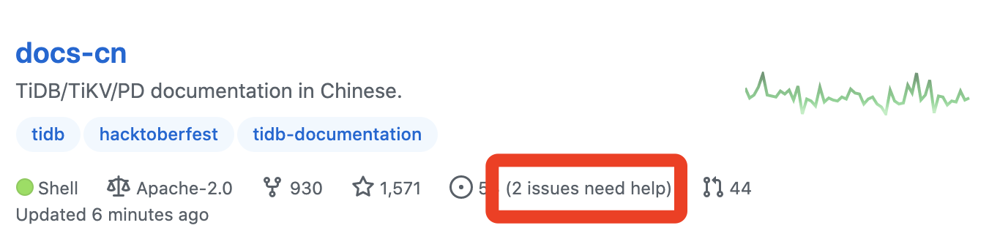
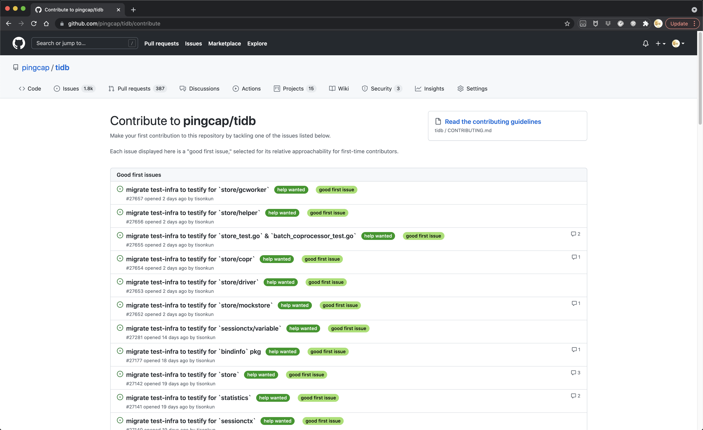

今天随便聊点简单的内容，来自于上周和 KubeSphere 等社区的同学探讨产生的群聊里提到的一个新问题。

上周的探讨其实针对不少问题都做了交流，聊了近两个半小时。日签第一篇就是当时从中得到的启发，正好是七天以前。后续我会逐步把当时讨论的问题逐个拿出来再讲一遍。

回到今天的问题，关注到一个实践的细节上，即标注 good first issue 和 help wanted 标签，应该遵循什么规则？

实话说，这个不太像是开发者会问出来的问题，其实也是一位运营同学问的。因为这个问题的答案对于开发者来说很显然，没有 assignee 希望调动广泛的社区成员参与的 issue 就适合标注 help waned 标签，适合刚接触这个社区的 contributor 上手的 issue 就适合标注 good first issue 标签。

这里展开讲两点。

一点是标签的名字。help wanted 和 good first issue 如果精确匹配的话，可以触发 GitHub 的隐藏功能。

对于 help wanted 标签，GitHub 会在 repo 概览页面显示一个到 help wanted 标注的 issues 的按钮。

对于 good first issue 标签，GitHub 会有一个展示所有被此标签标注的 issue 的页面。如果 repo 里有 CONTRIBUTING 文件，也会展示。

这个页面比较隐蔽，repo 上没有直接的选项卡入口，要么是直接拼 /user/repo/contribute 路径，要么就得留意到 issue 列表页面上的一个 banner 提示。

> Now, GitHub will help potential first-time contributors discover issues labeled with good first issue

这里的 discover issues 是个可点击的链接，点了就跳转到这个页面。

另一点是进一步深究原问题，什么是刚接触这个社区的 contributor 上手的 issue 呢？KubeSphere 社区的 Rick 有一个文件来介绍。

[open-source-best-practice/good-first-issue.md](https://github.com/LinuxSuRen/open-source-best-practice/pull/29/files)

为了控制我展开讲停不下来的风险，今天就点到为止。这个链接里关于模板和工具的部分我不太认同，有点过度运营了。前面的探讨部分，是一个很好的切入点。有一点必须帮他再说一次的，那就是 good first issue 适合“新人”，“新人”和技术水平的高低无关，只表明初次接触某个项目。
