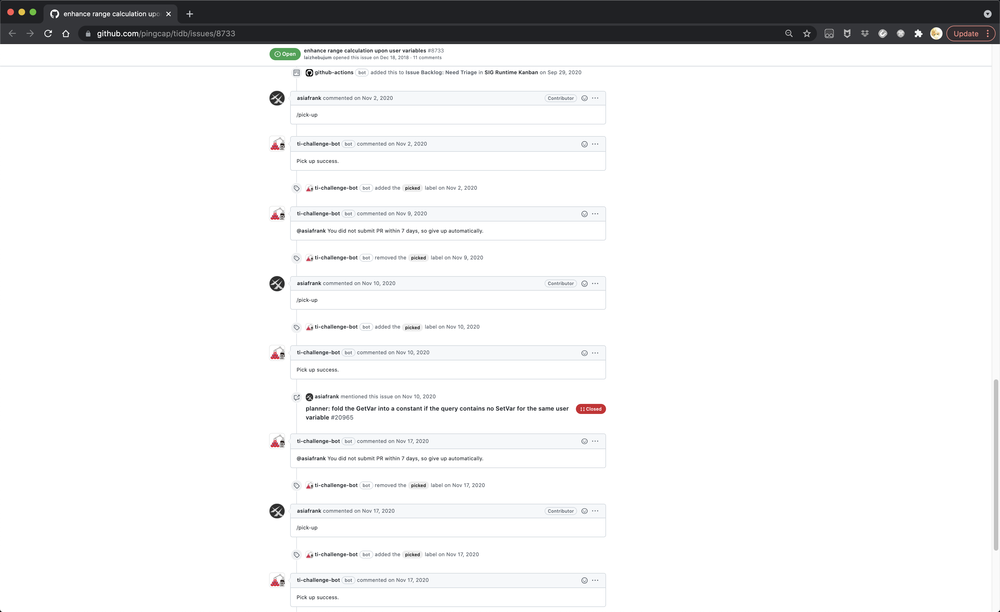
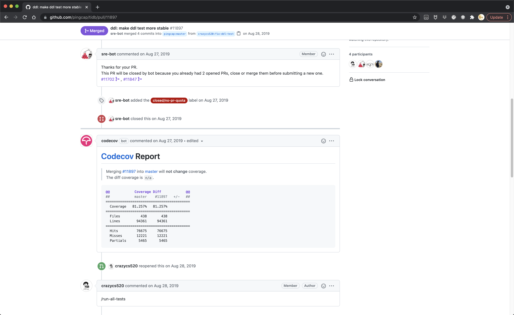
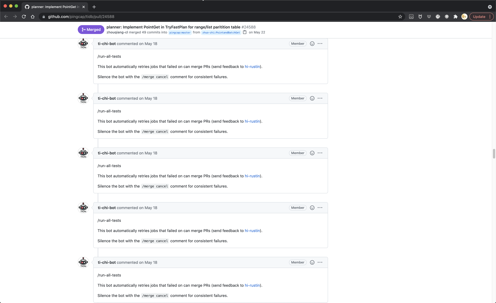
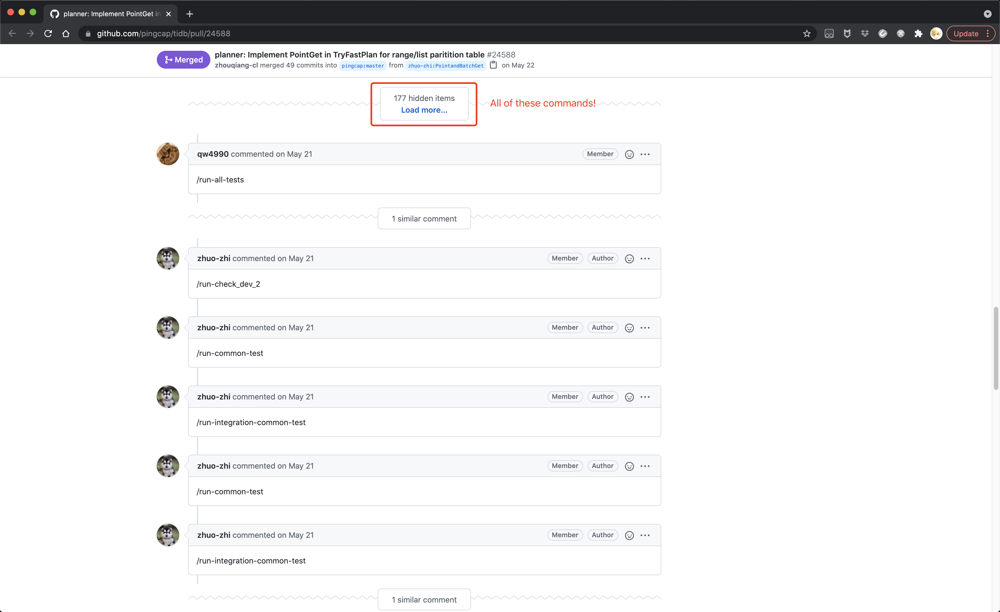

今天聊两个和开源协同有关的话题。

随着开源协同行业经验的积累和从业人员的成熟，最佳实践总是越来越好的。讨论过程中会涉及具体的开源社区案例，早期阶段的案例或多或少有不足之处，大多是时代所限，正是这些前人探索的实例，才构成了今天可以分析和演进的基础。

**第一个话题，开源社区中人与机器的关系。**

随着开源社区规模的壮大，早期社区能够藉由所有人相互熟识和过度沟通来协调的合作过程会越来越受到挑战。虽然我仍然鼓励社区成员积极地认识其他成员，但是不可否认的是，增长的社区逐渐要求一定的合作流程来减少摩擦。

这个过程中，社区会遇到两个挑战。一个是流程的复杂性，一个是流程的自动化。

流程的复杂性比较好理解，Jono Bacon 在[《社区运营的艺术》](https://book.douban.com/subject/26976995/)当中讲到流程时，采用的标题就是“流程，简单才能持久”，摘录其中的两段如下。

> 当流程成为达到最终目的的手段时，它就是有用的。我不想夸大制定流程的重要性，然而我确实想强调实施这些活动的重要性。换句话说，让社区新成员毫不费力地加入项目的确重要，但使这一切都发生的流程，决不能掩盖最终的目标。意识到流程就好了，但过分纠结于流程之中就不好，这会滋生形式主义。我们要把视线放在有价值的东西上。
> 
> 强调这个区别，有一个重要原因，即制定流程，是管理一组人的核心活动。不幸的是，管理的行为常常超越了管理的目标。制定流程时，要始终牢记这点，不要为了制定流程而制定流程，并非所有的问题，都可以用文件和规则来解决。

形成流程的规则之所以存在，是因为它们是规则。换言之，这是社区当中早就形成的实践或是热切期盼的指导原则。我们为了减少接纳新人的摩擦，以及明确地写下规则而制定流程，而不是为了制定流程而制定流程。这一点再怎么强调也不过分，因为几乎你的社区必定会遇到形式主义的问题。

形式主义会降低你的效率，逼迫你做一些奇怪的事情，《社区运营的艺术》举例与客服沟通商品问题而被要求填写表单或被各个机构踢皮球。这是必然带来的危害。然而，更糟糕的是，如果社区成员试图通过修正规则以外的手段来规避这种麻烦，将会带来更大的危害。

这种情况通常出现在多样性不足，某种背景的成员能够通过规则以外的手段合并代码，结束讨论，或其他需要流程决议的事项的社区。公开和平等是开源精神重要的一条，这样的行径，对于这些“特殊”成员来说或许是少了一点麻烦，但是却会破坏社区赖以生存的信任。那些看到特权行为的成员会想，为什么我们的社区制定了这些个形式主义的流程，难道只是为了妨碍没有“特殊”背景的成员参与，为了控制社区？

对于流程的精简，我的思考方式是，这个流程的受益者是谁，流程产生的结果的消费者是谁。如果发现流程没有受益者，或者很牵强的受益者，社区成员为了流程产生的行为和结果无人关心，那么这很可能就是一颗形式主义的毒草。

流程的自动化是个问题，这看起来有些迷惑。让机器人做样板化的动作能够减轻社区成员的负担，但是当机器人喧宾夺主，主导整个流程的时候，人就被绑架到了机器上。

Jona Bacon 在[《People Powered》](https://book.douban.com/subject/35531548/)当中提到

> 永远不要用事先写好的邮件或通知模板与成员交流。应该让计算机来检测模式，但是要让人来进行交流。如果不这样做，你就冒着让成员感到被欺骗的风险，就像那些假装成真人的机器来电一样。

这个例子举得很好，想想当你在电商网站购物时向客服反馈问题，却一直要和 AI 周旋的时候，这可不会是一个好的体验。

我们来看几个例子。

多的也不说了，或许这些机器人逻辑都有引入时的设想的情景。但是，利用上面的思考模板“这个流程的受益者是谁，流程产生的结果的消费者是谁”，实际上，除了引入流程时的想象，和实际被折磨的贡献者，并没有人关心这些内容，只会当成噪声忽略。有些“功能”或“问题”可以不通过机器人侵入或绑架流程的方式来实现或解决。

机器太靠前，人就太靠后。[《协同》](https://book.douban.com/subject/34834429/)当中提到管理学的演进的时候，认为协同强调人文主义，注重强个体的自我实现。

社区是由人所组成的，同时其平等和开放的氛围注定了传统管理手段将水土不服。从管理学当中汲取经验，同时尊重开源社区在简单高效以下，对平等和开放等基础原则的要求，才能形成提升社区协同效率的流程。

**第二个话题，开源社区当中的贡献。**

这个话题在我脑海里有一段时间了。昨天在社区话题探讨的群里，有一位同学问到开源软件项目当中的测试人员的定位问题。今天我跟 Python Committer [zhangyangyu](https://github.com/zhangyangyu)，也是团队的新成员交流的时候，基于我们在 TiDB 社区的观察，以及和社区维护者和社区中活跃的测试人员交流的内容，做了一些总结。

按照 zhangyangyu 的话说，这些本该是开源社区的常识。不过这或许就是回音室效应，真实的开源世界依旧冷清，热衷于开源软件，开源协同，开源运动的人们仍然需要打造自己的理论武器，才能在开源精神和指导原则被践踏的时候据理力争。

这个话题泛泛而谈就太多可谈的了。基于 TiDB 社区来讨论，正好今天将一个时代的治理模型 [SIG 收棺入殓](https://github.com/pingcap/community/pull/535)了。

真的是入殓，归档前还做了一番内容整理，这就看到了其中的一些问题。

> You are welcomed to be a contributor once one of your PR about `${module name}` is merged.

例如，SIG 组织治理的模板中，有这么一句话，其实是把 contribution 和 PR 关联起来，而 PR 最常见的就是编写代码。顺其自然的，以这份材料为指南来运行 SIG 的 leader 也会在 contribution 和 PR 进而是 code 画上等号。

> Be promoted to Reviewer:
>
> * Have at least **${a certain number}** PRs merged in the `${module name}` package within one year.
> * Fix at least **${a certain number}** issues whose difficulty is medium or above.
> * Present design ideas and adopt them in more than **${a certain number}** executable task.
>
> Be promoted to Committer
>
> * Exhibited good technical judgment.
> * Fix at least **${a certain number}** issues whose difficulty is high.
> * Have reviewed at least **${a certain number}** PRs in the `${module name}` package within one year.
> * Play an important role in a big feature.

进一步的，关于社区角色的赋予，也跟代码开发紧紧绑定在一起。

成熟的开源社区往往都会强调自己尊重并认同任何对社区有益的贡献，除了代码开发以外，评审变更或提议，撰写文档，报告缺陷，测试软件，写作博客，发展社区等等等等，都是被认可的。如果把贡献局限在写代码，实现功能上，那对于社区而言，近似于通过代码行数来衡量软件。

最后需要澄清的是社区当中的角色。如同 [The Apache Way](https://www.apache.org/theapacheway/index.html) 提到的，社区成员通过自己的贡献赢得权威，赢得信任。这种认可可以通过角色赋予来体现，但是本身是社区的共识。

我们必须要强调，Reviewer 和 Committer 的角色，不是社区当中的等级制度，而是一种信任的传递。社区的维护者赋予某位成员某个角色，不是升级或授予特权，而是基于信任简化社区参与的流程，同时鼓励这位成员进一步参与社区，发展社区，主持事务，自由发挥和自我实现。

如今的开源浪潮，带来了几何量级增长的开源社区的参与者，传统的管理观念，等级观念，势必剧烈的冲击开源社区尚未成熟的精神与原则。我想在这个时代学习开源，研究开源，归纳最佳实践，打造理论武器，正是时代交给我们的任务。如果你也有意加入到前沿的研究与实践当中，欢迎联系我，我们一起实现。
