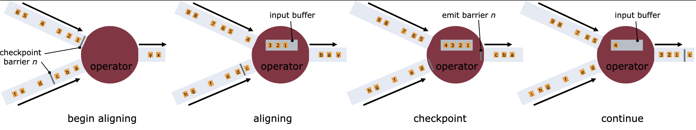

Exactly-once 简而言之就是保证数据记录在整个计算过程中恰好被处理一次。显然，每条数据恰好处理一次是整个计算结果正确性的必要条件。

同一进程的方法调用必定会执行，或者成功返回一个结果，或者调用失败抛出异常。分布式系统的调用请求，在成功处理和失败返回以外还有第三种可能性，即请求丢失，调用方无法确定请求是否送达。

这种情况下，如果不做重试，就是 at-most-once 送达语义，每个请求都只会被发送一次，并且永远不会重试。如果调用者通过重试试图保证请求会被处理，那就是 at-least-once 送达语义。

理想情况 exactly-once 总是基于 at-least-once 实现的。如果一个请求必须被处理但是不能被处理多次，那么，在 at-least-once 的语义基础上，接收者还必须对请求进行去重。

Flink 所说的 exactly-once 强调的，也是从结果来看，数据恰好被处理一次，或者说结果是数据恰好被处理一次时产生的结果。对于分布式系统的网络问题带来的消息重传，这是不可避免的。

Flink 实现 exactly-once 的手段包括网络传输层面的容错和作业层面的容错。

网络传输层面，Flink 的 Task 上下游之间通过 TCP 传输，并认为在 TCP 层面解决了消息重发和消息去重的问题。

对于其他不使用 TCP 传输的分布式系统，要支持 exactly-once 语义，也需要在应用层实现类似的重发和去重逻辑，方法和 TCP 采用的方法类似。

例如 Akka 用于替换 TCP 传输的 [aeron](https://github.com/real-logic/aeron) 库，就在 UDP 的基础上增加了基于消息 ID 的重试和去重逻辑，相当于 TCP 砍掉了流量控制的实现。实际上，由于在 TCP 做流控往往已经无法阻止应用层被消息压垮，包括 Flink 在内的分布式系统往往都会实现应用层的流程，应对 latency critical 的场景。

作业层面的容错是本文的重点。

对于批处理系统，数据输入是有限的。如果某个算子实例失败，只需要重新调度一个算子实例，并从上游重新拉取数据消费即可复现计算结果。

对于流处理系统，数据输入理论上是无限的，上游无法无限地持久化计算结果，同时下游也无法接受失败时重新处理从系统启动那一刻输入的数据，因此需要其他方案来实现 exactly-once 语义。

Flink 基于 [Chandy-Lamport](https://en.wikipedia.org/wiki/Chandy%E2%80%93Lamport_algorithm) 算法实现了自己的分布式快照算法，利用 state 和 checkpoint 机制实现了 streaming system 的 exactly-once 语义，下面我们介绍其实现方式。

### checkpoint 与 state

state 是与算子绑定的持久化状态。Flink 的作业表示为一个有向无环图，图上的节点即各个不同功能的算子，例如 Map 算子，Reduce 算子，Source 算子和 Sink 算子等等。应用层的算子可以通过实现 CheckpointedFunction 接口，读写 Flink 框架层面支持的状态。典型的 state 包括 Window 算子中当前窗口的中间状态，处理函数调用次数的计数器，以及 Source 算子中当前读取数据源的 offset 等等。

checkpoint 指的是 Flink 对所有算子的 state 做分布式快照的动作。checkpoint 成功时将产生一个序号全局单调递增的分布式快照，快照对应的逻辑时间上所有算子的 state 都可以从快照中可以恢复。

### state 与 exactly-once

如前所述，exactly-once 指的是数据记录在整个计算过程中恰好被处理一次，即最终的结果是数据记录恰好被处理一次的结果。

state 就是数据记录被处理之后产生的结果，因此 state 都应该是数据记录 exactly-once 处理的结果。由于 Flink 的传输是可靠的，在作业没有发生错误的情况下，这一点我们可以认为是成立的。

在作业发生错误的情况下，Flink 会将整个流图重启，从上一个 checkpoint 开始重新计算。同一逻辑时间上所有算子的 state 可以从 checkpoint 上恢复，下面就介绍这个恢复过程的细节以及 exactly-once 如何被保证。

首先是 Source 算子，支持端到端 exactly-once 的 Source 算子需要能够根据 checkpoint 提供的信息重播数据。如果数据源是不可重播的，例如无缓存的实时 socket，在错误恢复过程中，我们无法再次取得先前的数据，端到端 exactly-once 就无从谈起。

Kafka 是一种常见的可重播数据源，我们在 checkpoint 的时候将当前读取到的 Kafka partition offset 作为 Source 算子的 state 持久化，在错误恢复过程中，Source 算子即可恢复的 state 中读出 offset 并回拨 offset 重新消费重播数据。

对于其他算子，它们的输入来自于上游。现在 Source 节点产生的输出是正确不重复的，关联到自己的持久化 state 也已经被成功加载，只需要再次消费上游发送的数据，即可保证 state 是 exactly-once 处理的结果。没有上游的 Source 算子和所有存在上游的算子都满足 exactly-once 的语义，也就是所有算子的 state 都将是 exactly-once 处理的结果。

值得强调的是 Sink 算子。Sink 算子在写出到外部存储时，要实现端到端 exactly-once 也需要通过实现 CheckpointedFunction 接口来配合。

目前，Flink 通过两阶段提交原生地支持 Kafka 和 HDFS 等 Sink 的端到端 exactly-once 语义。如果想要实现其他 Sink 的端到端 exactly-once 语义，也推荐实现 TwoPhaseCommitSinkFunction 接口的方式。

此外，Flink 通过 GenericWriteAheadSink WAL 机制实现 Cassandra Sink 的端到端 exactly-once 语义。这个实现直接基于内部的 Operator 接口，用户几乎很难复用。

Sink 算子的特别之处在于它的逻辑跨越了 Flink 框架和外部存储的边界，因此为了实现端到端 exactly-once 语义，需要和外部存储互相配合。

值得一提的是，上面提到的 exactly-once 语义是基于 state 来描述的。如果数据处理逻辑有副作用，或者输出是非确定性的，会有一些不那么 exactly-once 的表现。

数据处理逻辑有副作用，例如在数据处理函数中打印数据，或者更改外部世界的状态，由于这样的副作用不像上面提到的 Sink 算子的跨越边界的一致性处理时那样被管理起来，当 Flink 框架做错误恢复的时候，是有可能多次执行副作用的。从用户角度来看，就是数据不止被处理了一次。这是无法避免的。

输出是非确定性的，例如在数据处理函数中获取随机数用于计算，容错前后的随机数取值很可能是不同的，从理论上说这不算是数据真的从头到尾仅处理一次的结果。另一个不太直观的例子是，数据处理函数中获取配置中心当前时刻的配置，甚至跟流处理的结果挂钩，前后读取到配置可能不同，这样两次取值可能是不同的。这类情况需要根据应用本身的性质选择忽略，或者将非确定性的部分也纳入到 checkpoint 当中一并管理起来。

### checkpoint 与 exactly-once

回过来讲清楚 Flink 的 checkpoint 机制如何产生最新版本的全局一致的 state 的分布式快照。

checkpoint 的完整过程由 JobManager 上的 CheckpointCoordinator 组件，TaskManager 上的 Task 和可靠的存储系统协同完成。

产生一个新的 checkpoint 的过程，首先由 CheckpointCoordinator 上的周期性作业触发，触发时向 Source 算子的所有 Task 所在的 TaskManager 发起 triggerCheckpoint 调用。

TaskManager 收到调用请求后，会调用对应的 StreamTask 的 triggerCheckpointAsync 方法，向 Mailbox 插入一条处理 checkpoint 的消息。

Mailbox 取出消息处理时，先向下游发送 CheckpointBarrier 然后触发本地 state 的快照。根据配置的不同，快照可能存储在内存中，HDFS 上，或 RocksDB 上再存储到 HDFS 上。

在快照成功生成之后，向 CheckpointCoordinator 汇报快照完成。

这一部分关键源码位置

* `CheckpointCoordinator#triggerCheckpoint`
* `Execution#triggerCheckpoint`
* `TaskExecutor#triggerCheckpoint`
* `Task#triggerCheckpointBarrier`
* `SourceStreamTask#triggerCheckpointAsync`
* `StreamTask#performCheckpoint`

对于其他算子，它们会陆续收到上游发送的 CheckpointBarrier 控制信息。如果仅有一个上游，在收到 CheckpointBarrier 之后就开始触发下发 CheckpointBarrier 和快照相关的逻辑；如果有多个上游，则在对齐所有上游的 CheckpointBarrier 之后才开始触发，在对齐之前 CheckpointBarrier 之后的输入将被缓存，不作处理。

对齐的过程可参考社区文档中的图片。

这一部分关键源码位置

* `CheckpointBarrierAligner#processBarrier`
* `CheckpointBarrierHandler#notifyCheckpoint`
* `StreamTask#triggerCheckpointOnBarrier`
* `StreamTask#performCheckpoint`

同样的，在快照成功生成之后，向 CheckpointCoordinator 汇报快照完成。

Flink 还支持 at-least-once 语义。这种语义下，算子实例不会在对齐 CheckpointBarrier 时缓存输入，而是继续处理，因此 state 可能是数据被处理多次的结果。

这也是 Flink 的快照算法与 Chandy-Lamport 算法的主要不同，即增加了 CheckpointBarrier 对齐的动作。FLIP-76 Unaligned Checkpoint 实现了无需对齐的快照算法，具体可以参考 [FLIP-76 的提案](https://cwiki.apache.org/confluence/display/FLINK/FLIP-76%3A+Unaligned+Checkpoints)和[介绍 FLIP-76 的博文](http://www.whitewood.me/2020/06/08/Flink-1-11-Unaligned-Checkpoint-%E8%A7%A3%E6%9E%90/)。

继续上面的过程，快照生成成功后，Task 会向 CheckpointCoordinator 汇报。汇报的核心逻辑是 state 做快照时存储在可靠的存储系统上的位置信息。CheckpointCoordinator 收集到所有 state 的汇报后，将上述位置信息等元数据信息打包为 CompletedCheckpoint 数据结构，持久化到外部存储系统中。具体的，Flink 的当前实现是存到 HDFS 上，然后把 HDFS 的句柄存到 ZooKeeper 上。

此时便可宣告 Checkpoint 完成，我们完成了一次分布式快照。

这个汇报和提交的过程可参考社区文档中的图片。

这一部分关键源码位置

* `StreamTask.AsyncCheckpointRunnable#reportCompletedSnapshotStates`
* `TaskStateManager#reportTaskStateSnapshots`
* `CheckpointCoordinator#receiveAcknowledgeMessage`
* `CheckpointCoordinator#completePendingCheckpoint`
