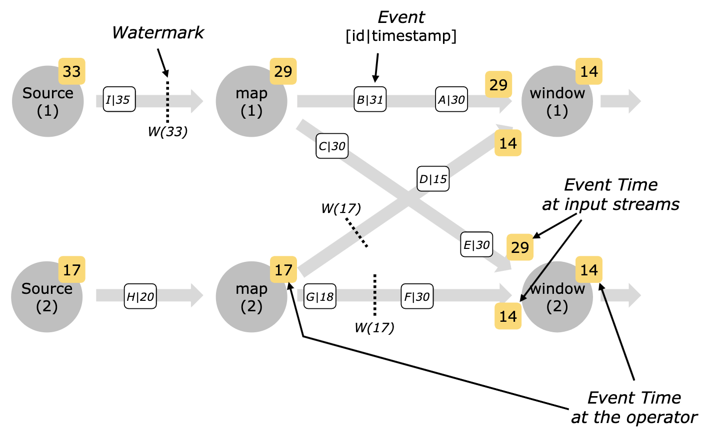

如果说 Streaming System 带来了什么新的挑战，这些挑战必然与时间息息相关。

不同于批处理系统有限的输入数据集，流式系统的主要特征之一是可以处理无界的输入数据集。典型的 Streaming 作业少则运行几个月，长则运行数年。这还是这个领域方兴未艾时的表现。

分布式系统拥有的资源是有限的，同时，流式系统的下游也需要输出结果来产生价值。这就要求系统必须在无界的输入数据集的一个子集上触发计算，而 Watermark 就是一种典型的触发计算的手段。

引用 [link3280](https://github.com/link3280) 在[浅谈大数据的过去、现在和未来](https://mp.weixin.qq.com/s/y2L8KQwb1YmnNQF6D-TjFQ)当中的观点，流式系统的经典论文 [The Dataflow Model](https://storage.googleapis.com/pub-tools-public-publication-data/pdf/43864.pdf) 引入了 Watermark 和 Accumulation Mode 两个关键概念。

这里的 Watermark 可以进一步抽象，代表的是触发计算的机制。Flink 定义了 Trigger 接口，除了 Watermark 配合 Timer 来触发，也可以用输入数据 Event 来触发。

下面分三个话题介绍 Watermark 机制。

**第一个话题，Watermark 的定义和功能。**

Watermark 这个词不好翻译，无论是水位线还是水印，都不能准确的表达在流式系统中时间推移这样的概念。

Watermark 会绑定一个时间戳，当算子处理到一个 Watermark 时，从定义上就代表了 Watermark 绑定时间戳之前的数据已经全部到达。

例如，算子处理到一个绑定 11:45 时间戳的 Watermark 时，就意味着 11:45 以前的数据已经全部到达，可以触发与时间绑定的逻辑，例如窗口的计算等等，并将结果推送给下游。

如果流式系统采用 Processing Time 作为时间特性，Watermark 并不是必须的，因为算子可以基于本地时间判断 11:45 以前的数据已经到达。

Watermark 的实用场景主要是在 Event Time 作为时间特性的场景。这种情况下，数据的时间属性在数据产生时绑定到数据上，即数据本身包含时间属性。由于分布式系统天然的延迟和乱序，流式系统处理这些数据的时候，从前往后几乎不能保证数据的 Event Time 是有序的。

也就是说，有可能已经处理了海量 12:30 之后的数据，但是还是有一个 11:44 的数据姗姗来迟。

理论上，迟到的数据有可能无限延迟，系统必须要有机制来推动计算往下进行。这就是 Watermark 的作用，告诉算子其对应的时间戳之前的数据已经全部到达，算子可以基于这个假设拨动自己的 Event Time 时钟并触发相应的计算。

不知道你是否和最初接触到这个概念的我一样，对 Watermark 如何确保之前的数据已经全部到达充满疑惑，其实这就是 Watermark 最重要的话题。

**第二个话题，Watermark 的产生和传播。**

为了应对不确定的时间和延迟，Watermark 的产生和传播机制有非常多的变体。短小的篇幅不太可能完全穷尽，只对主要的几种情况做讨论。

回到刚才的话题，Watermark 如何确保之前的数据已经全部到达呢？答案是根据定义。

根据定义的意思就是这是一个不证自明的约束，现实地说，需要产生 Watermark 的源头自行保证。

实际上，Watermark 分为 Perfect Watermark 和 Heuristic Watermark 两种。前者顾名思义，能够通过推理来证明 Watermark 其对应的时间戳之前的数据已经全部到达。后者顾名思义，启发式地“估计”之前的数据已经全部到达。由于启发式的方法会有误差，所以还有往上打补丁的 Allow Lateness 一类的机制。

先说 Perfect Watermark 的情况。

前面提到分布式系统天然的延迟和乱序，导致输入数据的 Event Time 几乎总不是有序的。但是凡事总有个万一，如果数据流水线足够简单，上游一环一环都能保证数据有序，那么这种情况下数据本身的时间作为 Watermark 就是 Perfect Watermark 了。

一个典型的情况就是所谓的 Ingestion Time 时间特性。数据在进入 Flink 的时候被打上 Event Time 信息，虽然实用中这么做几乎没有额外的价值，但是加上 Flink 系统内的数据传输是有序的这一点，就可以保证 Watermark 是 Perfect Watermark 了。

再说 Heuristic Watermark 的情况。

典型的 Heuristic Watermark 启发策略是在数据的 Event Time 时间戳之上做一个时间差。比如，经验主义地知道上游 Kafka 的数据不会慢 1 分钟，那么就可以基于数据的 Event Time 减去 1 分钟得到对应的 Watermark 了。

其实，如果这个经验在系统稳定运行时总是成立，在这段时间内的 Watermark 就是实质上的 Perfect Watermark 了。

不过，启发式的策略几乎总是会有意外。这个时候 Watermark 的不准确就会导致窗口计算等逻辑没有处理到全量的数据。

为了应对这个问题，一种方式是加入 Allow Lateness 的机制，在 Watermark 触发计算并将结果推到下游之后，仍然维护先前的状态 Allow Lateness 允许的延迟时间。在这个时间内，如果有延迟数据到来，可能会重新触发计算并推送新的结果，并可能包含对先前推送结果的撤销。超过允许的延迟时间，状态被清理，迟到数据也将被直接丢弃。

上面的描述中，Watermark 的产生几乎总是从数据源开始的，这也是最常见的情况。下游的 Watermark 通常从上游传播得到。

Flink 采用了多种数据通道来分别处理数据，Watermark 和 CheckpointBarrier 等信息。这有点像 FTP 区分数据管道和命令管道的做法。

如果算子只有一个上游，Watermark 通过专门的 Watermark 管道向下游传播，下游直接 respect 上游的 Watermark 就可以得到自己的 Watermark 了。由于 Source 的 Watermark 有可能从数据中取得，本身并不是单调递增的，而时间如果会来回跳跃，窗口计算等逻辑将无法定义。因此，下游总对于同一个上游来的 Watermark 取最大值，确保时间总是向前推进。

如果算子有多个上游，对单个上游，出于同样的原因采用上述同样的逻辑。同时，当前算子的 Watermark 需要基于每个上游的 Watermark 最大值再取一次最小值。

这也很好理解。因为当前算子的计算依赖于多个上游的结果推送，因此只有在确保所有上游的结果都以就绪，当前算子才能触发计算。

这其实是计算机策略设计当中常见的 MinMax 策略。具体图示如下，出自 Flink 官方文档。

Watermark 的传播是 Flink 框架写死的逻辑，但是 Watermark 的产生却是从头到尾都由应用逻辑决定。

上面提到的各种基于数据 Event Time 产生 Watermark 的策略，Flink 归类为 Punctuated 策略。Flink 还有另一种基于 Processing Time 生成 Watermark 的策略，即 Period 策略。这其实就是 Ingestion Time 的策略，基于 Source 算子的处理时间定期的产生 Watermark 向下游发送。

值得澄清的是，如果仅使用 Period 策略产生 Ingestion Time 的 Watermark 但是仍然使用数据本身的 Event Time 信息，这并不是前面所说的 Ingestion Time 的 Watermark 作为 Event Time 从而是 Perfect Watermark 的情况，而是很有可能出现计算结果不确定性的搭配。尤其是在错误恢复场景，Watermark 的产生可能被数据处理所抢占，因此有所滞后的情况。

此外，Flink 其实支持在任意算子上添加 WatermarkStrategy 以实现算子自定义的 Watermark 产生策略。这种情况很少见，这个接口的用法通常也只用在数据源算子上。

最后吐槽一句，一段时间没见，Flink 用 [FLIP-126](https://cwiki.apache.org/confluence/display/FLINK/FLIP-126%3A+Unify+%28and+separate%29+Watermark+Assigners) 又搞了一轮面向对象大师才懂的重构，引入了 WatermarkStrategy 的概念，整了一堆 Adapter 临时类，把废弃和移除的工作交给似乎永远不会到来的 2.0 去头疼。这代码看得难受。

**第三个话题，讲一讲 Watermark 迟到的处理。**

上面的讨论还缺了一种异常情况，即如果 Watermark 迟迟未到，下游岂不是时间也要停滞？

对于单个上游的情况，Watermark 迟迟未倒意味着唯一的上游出现了问题或者没有数据，数据流水线停滞是意料之中的。

对于多个上游的情况，由于 Watermark 的 MinMax 策略，下游的 Watermark 会被最慢的上游拖垮。

实际应用中，下游算子处理多个 Kafka 的输入，其中一个暂无数据，而其他 Kafka 正常输入数据，往往此时业务方希望下游将暂无数据的上游视为空输入继续计算输出结果。

然而，由于 Punctuated 策略下 Watermark 由数据产生，没有数据输入也就没有 Watermark 的推进，下游时间就停滞了。

Flink 为此实现了标记数据通道 idle 的功能，能够通过 WatermarkStatus 管道传播 idle 事件。下游算子收到 idle 事件后，将对应上游标记为 idle 状态，且后续不参与 Watermark 的 min 计算。如果这个通道又产生了数据，那么其对应的 Watermark 会恢复计算并且同步将 active 事件带到下游。

曾经有段时间我以为这个 idle 机制是有缺陷的。如果某个通道被标成 idle 状态，稍后恢复数据输出，Watermark 也对应产生。这个 Watermark 可能对应着很早之前的时间，而之前下游计算 Watermark 时，跳过了这个通道向前推进，此时就可能因为它参与到 min 的计算而导致时钟回退。

前文说过，时间来回跳跃会破坏窗口计算等逻辑对时间单调递增的假设。

不过在去年底验证的时候，我发现这个顾虑是多余的。

计算 Watermark 的主体逻辑在 StatusWatermarkValve 类里。根据源代码，进入 idle 状态后，会执行 isWatermarkAligned=false 将该通道的 Watermark 状态就会被置为非对齐的。

对于从 idle 中恢复的通道及其携带的 Watermark 的场景，当且仅当其 Watermark 比算子向下游输出的 Watermark 大，即追上其他算子的时间后，才会将其状态置为已对齐的，并参与到 Watermark 的计算中，向下传播。

这样的逻辑通过将过早的 Watermark 丢弃，避免了时钟的回退。

关于时间的问题，还有很多前沿研究做了详细的讨论。本文点到为止，明天讲完 Flink Runtime 的主要交互逻辑以后做一波书籍推荐。
