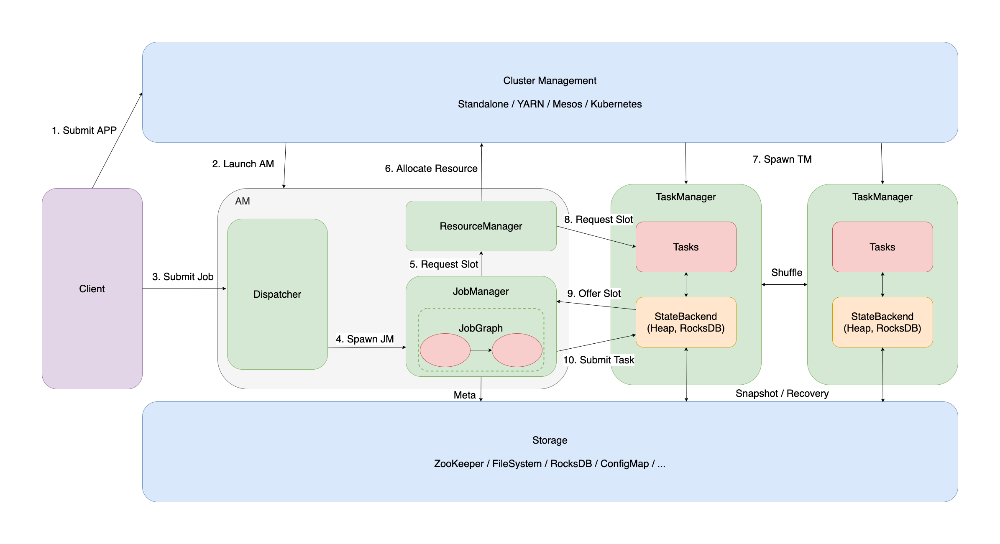

今天对着下面的流程图简单介绍一下 Flink Runtime 的各个组件及其交互流程。

由于每个流程细讲内容太多，Flink 经过多年的发展在每个环节上有复杂的策略，这里只会对着图例简单讲讲，更多的信息留给其他文档材料。

**第一个流程，提交 Flink 应用。**

其实这个流程里面就有很多策略。如果是 JobCluster 或者 AppCluster 的部署模式，其实这个流程里会把从用户应用编译得到的 JobGraph 一并打包进 Entrypoint 交给 YARN 或 Kubernetes 启动应用，并省略掉第三个流程 Submit Job 的步骤。

这个图上的流程可以认为是 SessionCluster 的部署起点。实际上，对于 Streaming 作业来说，资源独占才是 long running 作业的最佳策略，因此抽象出 Dispatcher 和 ResourceManager 并期待服务多个 JobManager 的情况并不务实。

* [Deployment](https://nightlies.apache.org/flink/flink-docs-release-1.13/docs/deployment/overview/)
* [3.22 【1.10特别篇】Running Flink on Kubernetes natively](https://www.bilibili.com/video/BV1F5411r72P/)

**第二个流程，启动 Flink 应用。**

与上一个流程一脉相承。

这里需要说明的是 Flink AM 包括 Dispatcher / ResourceManager / JobManager 三个组件，其中前两个组件在每个 Flink 集群当中是唯一的，而 JobManager 理论上可以有多个，每个对应到一个 JobGraph 表示的任务。

Dispatcher 类似于 API Gateway 的角色，主要处理 Client 的请求，把相关的命令或数据采集请求转发给其他两个组件处理并返回结果。此外，可以接受 Client 提交的 JobGraph 并创建对应的 JobManager 实例。

吐槽一个技术细节，这三个组件各自有自己的选主机制，但是实际上一直以来都在同一个 JVM 里，完全可以共享选主的概念，不会出现 AM 和 Standby AM 一边有一半 Leader 的坑爹情况。

如果不为了这种奇怪的拆分要求，完全可以参考 FLIP-6 之前的架构，一个 JobManager 带着 Resource Client 做资源管理，顺便解决网络请求完事。

不过话说回来，这种过度的拆分倒也是一种技术壁垒，其他 Streaming System 初创团队也完全抄不动。

* [FLIP-6 Flink Deployment and Process Model](https://cwiki.apache.org/confluence/pages/viewpage.action?pageId=65147077)

**第三个流程，提交 Flink 作业。**

只在 Session 模式下有用，Job 和 Application 模式下 Dispatcher 会拒绝这种请求。

* [Submitting a Job](https://nightlies.apache.org/flink/flink-docs-release-1.13/docs/deployment/cli/#submitting-a-job)

**第四个流程，创建 JobManager 实例。**

前面提到了，Dispatcher 几兄弟都在一个 JVM 里，每个 JobManager 就是一个线程。具体地说是 Akka 实现的 Actor System 里的一个 Actor 实例。

JobManager 会接收 JobGraph 并编译到 ExecutionGraph 再进行后续的流程。这个过程大概是把逻辑计划转成了物理计划，不过由于资源信息早就配好了，在这个阶段也不会去看 Source 数据统计信息或 TaskManager 资源情况，所以并没有优化的过程，而是比较机械的翻译。

核心的动作是把逻辑计划 JobGraph 当中代表 Transformation 的节点，根据并发度拆成实际的 Execution 节点，并且根据 Shuffle 的策略把 Execution 之间的上下游管理配好。

* [Parallel Dataflows](https://nightlies.apache.org/flink/flink-docs-release-1.13/docs/learn-flink/overview/#parallel-dataflows)

**第五个流程，JobManager 向 ResourceManager 要资源。**

其实后面几个流程联系非常紧密，不过我还是一个一个讲，最后一并做个总结好了。

JobManager 完成编译后，就要把 Execution 部署出去执行了。

这里插一句，大部分分布式计算引擎，都是在某种意义的 Master 节点做完静态编译以后，把执行计划部署出去驱动执行的。这种做法调度的重任放在 Master 节点上，其实是简化了系统。因为 Task 部署出去的时候已经有全量信息，尤其是上下游在哪的信息。当然，这样做的问题就是不能根据运行时的实际情况做出灵活调整，尤其是动态调整计算图。目前，我了解到的能做到动态编译调起下游的，只有 ray-project 的 Ray 系统。

JobManager 自己其实也维护一个叫 SlotPool 的资源池，ResourceManager 维护一个叫 SlotManager 的资源池。这个调度其实有些多余，也是因为 Flink 设计上考虑了多个 JobManager 导致的。

如果 JobManager 的 SlotPool 有足够的资源，那么不会有这个流程，而是直接走第十个流程提交作业。如果 JobManager 资源不够，才会向 ResourceManage 要资源。

* [ray-project/ray](https://github.com/ray-project/ray/)
* [Ray: A Distributed Framework for Emerging AI Applications](https://www.usenix.org/system/files/osdi18-moritz.pdf)

**第六个流程，ResourceManager 向资源集群要资源。**

回过头来看，ResourceManager 理论上对整个 Flink 应用做资源的簿记，JobManager 找它要资源的时候，是有可能存在空闲的资源的。

这种情况下，ResourceManager 会向 TaskManager 发一个请求，带上 JobManager 的信息，并要求 TaskManager 向 JobManager 提供资源。这是第八个和第九个流程。

反过来，如果是应用刚起来等资源不足的情况，ResourceManager 就会向资源集群要资源。这也是前文说 Flink 的 ResourceManager 其实很大程度上是个 ResourceClient 的角色。真正占有和调度资源的源头是集群管理器，也就是 YARN 的 ResourceManager 或者 Kubernetes 的 API Server 等。

资源集群受到请求后，会对应创建一个容器并起起来 TaskManager 实例，实例启动后根据启动时传递的环境变量，找到 ResourceManager 并上报自身的状态。ResourceManager 随机将资源簿记，并执行前述第八个和第九个流程。

当然，在 Standalone 部署的情况下，TaskManager 是手动起起来的。这种情况下 TaskManager 同样根据先验知识找到 ResourceManager 并上报。

我不确定 Flink 后来是否在这方面做了优化，但是一两年前的 Flink 对资源管理非常粗糙。TaskManager 的大小如果手动起起来的，那自然是给多少资源就有多少资源。而如果是容器化的环境，之前每个 TaskManager 的大小是全局统一的配置。这种设计导致了后续复杂的资源重用机制。

* [Native Kubernetes](https://nightlies.apache.org/flink/flink-docs-release-1.13/docs/deployment/resource-providers/native_kubernetes/)
* [Apache Hadoop YARN](https://nightlies.apache.org/flink/flink-docs-release-1.13/docs/deployment/resource-providers/yarn/)

**第七个流程，启动 TaskManager 实例。**

**第八个流程，ResourceManager 分配资源。**

**第九个流程，TaskManager 提供资源。**

**第十个流程，提交 Execution 到 TaskManager 运行。**

这几个部分没啥好说的，参考这方面的专家 [xintongsong](https://github.com/xintongsong) 大佬的介绍即可，概要前文已经讲过。

五藏老师，我的超人。

* [3.28【实时数仓篇】深入解读 Flink 资源管理机制](https://www.bilibili.com/video/BV1ht4y127UV/)
* [3.23 【1.10特别篇】Flink TaskExecutor 内存管理与配置](https://www.bilibili.com/video/BV1At4y1U7vH/)

这里有一个点，我个人认为 TaskManager 是个多余的抽象，又是搞 Slot 又是搞各种 Sharing 手段，弄得无比复杂。其实容器化的大环境下，资源的分配走 Driver + Executor 的套路，根据 Execution 的需求直接向 Cluster 要就好了。每个 Execution 要对应的资源，能少不少事情。

最后讲两个图上体现的点。

**第一个是 Shuffle 机制。**

Data Shuffle 是分布式计算引擎网络开销的大头，如何优化 Shuffle 的性能，减少数据落盘，保证数据有序，都能成为一个系统的核心功能。这里不做复杂的展开，仅引用 [zhijiangW](https://github.com/zhijiangW) 大佬的 Shuffle Service 提案，以及提一下 Task 跟 Task 之间并没有控制信息的交互，只是基于 Netty 搭建非常底层的网络连接来传输数据。当然，如昨天的文章所说，这个连接传输的数据是多样的，包括了计算数据，Watermark 以及 CheckpointBarrier 等。

* [FLIP-31: Pluggable Shuffle Service](https://cwiki.apache.org/confluence/display/FLINK/FLIP-31%3A+Pluggable+Shuffle+Service)
* [FLIP-184: Refine ShuffleMaster lifecycle management for pluggable shuffle service framework](https://cwiki.apache.org/confluence/display/FLINK/FLIP-184%3A+Refine+ShuffleMaster+lifecycle+management+for+pluggable+shuffle+service+framework)
* [【Apache Flink 进阶教程】7、Flink 网络流控与反压剖析](https://www.bilibili.com/video/av55487329/)

**第二个是 Flink 系统当中的存储。**

Flink 其实是一个不自带存储的系统，这也是某些初创公司觉得流式计算的商业领域还大有可为的原因。用户数据从数据源中来，到数据汇中去，Flink 系统当中只是短暂停留。

但是，Flink 支持有状态的流式计算，同时又需要保证错误恢复场景能够维持 exactly-once 的语义，本身还是要保存一些内容的。

这就是图上 Storage 部分的价值。当然，Flink 对 Storage 的需求是依赖于现有存储系统的。

一方面，依赖 ZooKeeper 或 ConfigMap 来储存元数据信息，包括 JobGraph 和 Checkpoint 等。另一方面，依赖 HDFS 来持久化状态快照。RocksDB 在这里面扮演的角色其实是一个大号内存，在做 Snapshot 的时候会被整个存到 HDFS 上。当然，如果你开了 [shixiaogang](https://github.com/shixiaogang) 大佬做的 RocksDB StateBackend 增量快照，是不用每次都存整个 RocksDB 的。

* [FLINK-5053 Incremental / lightweight snapshots for checkpoints](https://issues.apache.org/jira/browse/FLINK-5053)
* [File Systems](https://nightlies.apache.org/flink/flink-docs-release-1.13/docs/deployment/filesystems/overview/)
* [High Availability](https://nightlies.apache.org/flink/flink-docs-release-1.13/docs/deployment/ha/overview/)
* [State Backends](https://nightlies.apache.org/flink/flink-docs-release-1.13/docs/ops/state/state_backends/)

可能会有人问，Flink 系统里的状态，不就是它存储的有价值的数据吗？

没错，Flink 提供了一个叫 [Queryable State](https://nightlies.apache.org/flink/flink-docs-release-1.13/docs/dev/datastream/fault-tolerance/queryable_state/) 的功能，支持从系统外直接读状态数据。不过这也是一个长时间的实验特性了，做了好多年一直不可用。

一种可能的方向是，Flink 的状态后端接了一个生产可用的存储系统，解决好数据一致性的问题。这样，就同时具备了 Remote State 的能力，并且在成熟的存储系统上可以基于它原来的查询接口读状态数据。

最后，做一波流式计算的书籍推荐，要是这里能插小卡片，我将绝杀，可惜插不得。

[Fundamentals of Stream Processing](https://book.douban.com/subject/22017723/)

基于 IBM InfoSphere 系统介绍流式系统的著作，讲透了很多基础的 Streaming 概念，必读。

[Streaming Systems](https://book.douban.com/subject/27080632/)

基于 Dataflow Model 介绍流式系统的著作，其实就是 Google Dataflow 和 Apache Beam 背后的理论基础。Streaming 101 和 Streaming 102 仍然是流式系统入门必读的内容。

同时，这本书在介绍 Streaming SQL 的时候有很多鞭辟入里的观点，请来了 Calcite 的创始人 Julian Hyde 讲了 time-varying relations 的定义和实用。

必读。

[Streaming Processing with Apache Flink](https://book.douban.com/subject/30152777/)

[Streaming Processing with Apache Spark](https://book.douban.com/subject/30152733/)

前面两本书其实或多或少有点阳春白雪的意思，这两本书介绍了大数据领域的双子星，Flink 和 Spark 在流处理上的架构设计，概念实现和技术细节。如果你是 Streaming System 的从业人员，这两本书不读也是说不过去的。
