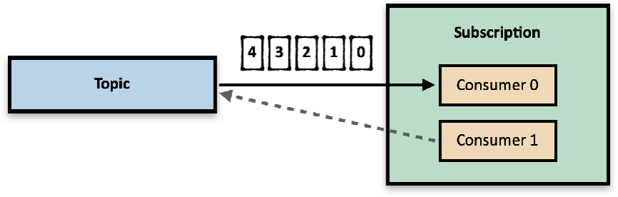

今天 Apache Pulsar 项目的主要参与公司 StreamNative 发布了 A 轮融资消息，引起了广泛关注。

[StreamNative 宣布 2300 万美元 A 轮融资，Prosperity7 Ventures 与华泰创新联合领投](https://mp.weixin.qq.com/s/NsG61FCn8bXJcjrNAgeXRA)

有不少同学对 Apache Pulsar 感兴趣，正好之前了解这个项目的时候写过一篇文章，旧文重发做个介绍。

# 云原生的消息平台 Pulsar

企业中的不同的应用系统共同支撑起了业务的运行，在企业的发展过程中，总会有应用系统需要以设计时未曾想过的方式集成在一起。在过去二十年的实践当中，消息传递技术通过使用消息同步两个系统，同时又能够解耦消息的发送者和接收者，很好地解决了这个问题。

说起企业级的消息平台，很容易想到 Kafka、RabbitMQ 和 RocketMQ 等等产品。但是近年来异军突起的 Pulsar 正以超乎寻常的加速度进入开发者的视野，究其原因，是因为它在滚滚而来的云原生浪潮当中最好地利用了云原生的优势。

## 云原生浪潮

或许前两年我们还能说云原生是一个充满希望的未来技术，但是如今云原生已经渗透到了现代软件开发的方方面面。云原生不再只是未来，而是既是现在，也是未来。

云原生的云是本地的扩展概念，传统的应用必须直接跑在本地服务器上，现在流行的应用还可以跑在本地或远程的容器化的环境里。

云原生的原生即软件设计之初就考虑到了将来会被运行在云端的可能，从而在设计层面上就充分利用了云资源的特点，典型的是分布式和弹性伸缩的能力。由于本地服务器是云的一个退化概念，云原生的软件也能自然的适配到传统的部署模式上。

Pulsar 之所以说是云原生的消息平台，核心就是它的架构设计能够充分利用分布式的、能够弹性伸缩的云端资源。

## Pulsar 的系统架构

典型的消息系统包括 Producer、Broker 和 Consumer 三个部分，其中关键性的角色是 Broker。正因为有了 Broker 承担了消息无差别存储和重新分发的责任，才使得消息的发送者和接收者能够解耦。同时，Broker 接受和分发消息只依赖于消息的格式，从而应用可以灵活地上线和下线生产者或消费者。

Pulsar 也是消息平台，因此它的整体架构也没有超出这个框架。

然而，Pulsar 从存储与计算分离的思想中得到启发，独特地把传统消息平台中同时兼顾消息存储和消息分发的 Broker 角色进一步拆分，分成专门处理消息存储的 Bookie 部分和专门负责接收和分发消息的 Broker 部分，从而解放了 Broker 中维护本地状态的职责。

同时，对存储的形式做了多主复制的改造，结合上面的存储与计算分离的拆分，真正做到了系统内所有同类型的节点之间的对等。

只有做到节点对等，才能够最大程度的利用云存储弹性伸缩的能力。

## 水平扩容

本节中我们分别讨论 Pulsar 消息平台上多个组件和消息主题（Topic）的水平扩容。

Pulsar 典型的消息传递模式是将消息按照 Topic 分类，Producer 发送消息时将指定这个消息是属于哪个主题的，而 Consumer 订阅消息时也是按照主题的粒度来订阅消息的。

同一个 Topic 的消息以 Segment 的粒度被分散存储在若干个 Bookie 上，并有相应的冗余系数。每一个 Topic 的消息收发只能由单个 Broker 来承担，这是为了保证一定的顺序性而对吞吐量做出的权衡。当吞吐成为瓶颈时，可以采用 Partitioned Topic 技术来扩展同一个逻辑 Topic 下的物理 Topic 数量。因此，Pulsar 中的 Topic 概念更像 Kafka 中的 TopicPartition 概念。

下面，我们分别从 Broker、Bookie、Producer、Consumer 和 Topic 的角度来讨论 Pulsar 的水平扩容。

### Broker

Pulsar 的 Server 端由 Broker 和 Bookie 组成，Broker 是收发消息的无状态服务。

通常情况下，Topic 和 Bookie 的数量都是远大于 Broker 的。

一方面，单个 Topic 所需的吞吐量一般不会占满一个 Broker 实例，Pulsar能够支持百万级的 Topic 的生产消费，但现实中几乎不存在百万级的计算节点，千级万级的计算节点已经是非常罕见的超级业务了。

另一方面，为了存储海量的历史信息需要大量的 Bookie 节点，而消息即时性导致历史消息很少被消费。

Broker 的扩容场景往往是为了应对业务访问突增的情况，例如典型的电商业务大促。在这种场景，通过合理的设置消息保留时间，消息的存储即 Bookie 的压力可能并不是很大，单独扩展 Broker 即可应对大量下游活动 Consumer 的吞吐需求。

由于大部分场景下 Topic 是远大于 Broker 的，因此我们不太需要考虑 Broker 大于 Topic 时扩展 Broker 不再对吞吐有效的场景。即使出现了这种情况，也可以通过新增 Partitioned Topic 来应对。

Broker 是无状态的计算节点，它的扩容是平滑的。新的 Broker 节点上线后会将自己注册到集群中去，通过负载均衡算法获取部分 Topic 的服务职责对外提供服务。

### Bookie

Bookie 是负责存储消息的有状态服务，每个 Bookie 上以 Segment 的粒度存储不同 Topic 的消息段。

Bookie 实际上是 BookKeeper 集群的节点，BookKeeper 存储消息段的元数据信息并支持 Broker 根据相应的索引顺序的访问消息内容，从而在逻辑上达到连续的消费消息队列的效果。

Bookie 的扩容往往是在消息容量暴涨，同时消息保留时间无法在业务能忍受的范围内进一步压缩的情况。如果整个集群每秒产生数个 GB 甚至 TB 的数据，怎么能指望单个 Bookie 实例能够扛下来呢？

有状态的 Bookie 之所以在扩容的场景下能做到节点对等，是因为组成 Topic 的 Segment 透明地冗余分布在多个 Bookie 节点上，同时，多个 Bookie 节点之间没有主从之分。

新的 Bookie 节点上线以后会向 BooKeeper 集群注册自己。在其他所有外部环境没有变更的情况下，在 BookKeeper 决定将新的 Segment 写到哪个 Bookie 上的时候，根据负载均衡算法能够自动的启用新上线的 Bookie 来承担这部分的存储任务，从而缓解现有 Bookie 的压力。前面提到集群会管理 Segment 之间顺序的元数据，因此这样的负载均衡对应用端是无感知的。

Kafka 要扩容存储则完全不一样。

由于 Kafka 限制单个 Partition 必须完整的存储在同一个 Broker 上，同时 Partition 的冗余是按照主从复制来实现的，这就导致新的 Broker 节点上线之后，必须等待一段长时间的数据同步，直到把需要提供服务的 Partition 的数据都追赶上之后，通过重新触发选举让新的节点成为相应 Partition 的主节点，才能开始对外服务。

这不仅仅是存储的浪费，而且一次扩容会耗费很长的时间。下面的图生动地展示了这两者的不同。

关于存储，值得一提的是 BookKeeper 对 I/O 做了细致的抽象，区分了读和写的访存路径。只要写成功了就可以返回 Producer 消息生产成功，而数据的排序和导入到读盘是完全异步发生的。这样本身就提高了写的性能，同时还支持对读写的存储独立的进行配置，避免写的瓶颈同时需要提升本已足够的读的配置。

### Producer

Producer 的扩容很简单，往往是生产者客户端需要提高自己的吞吐。

Producer 的扩容没有任何的依赖项，只需要简单的上线新节点就可以，新的节点将正常的连接到 Broker 并生产相应 Topic 的消息。

### Consumer

Consumer 的扩容是一个比较 tricky 的事情，因为在 Pulsar 的模型里这跟订阅模式有关。

Pulsar 的消息消费是以 Subscription 的粒度来进行的，Subscription 的概念可以类比 Kafka 的 ConsumerGroup 的概念。

Pulsar 有四种不同的订阅模式。

Exclusive 订阅模式下，同一个 Subscription 里只有一个 Consumer 能消费 Topic，因此扩容会报错。

就算是少量的 Consumer 节点以不同的 Subscription 身份订阅大量的 Topic，希望通过上线新的 Consumer 以减少已有 Subscription 里 Consumer 的负担，也不会成功。

Failover 订阅模式与 Exclusive 订阅模式唯一的不同就是它允许同一个 Subscription 里注册不同的 Consumer。虽然同一个时刻只会有一个 Consumer 在消费，但是如果 Consumer 发生异常，Subscription 里的其他 Consumer 可以接替它继续消费。

这种订阅模式下扩容 Consumer 也是没有作用的，因为新上线的 Consumer 只能作为 standby 而不能立即开始承担消费压力。

可能一种直观的想法是扩容后闪断原来的 Consumer 以触发 Consumer 的重新分配，但是考虑到闪断重连的开销，这完全是舍本逐末。

Shared 订阅模式下，Topic 里的消息会被均匀的分发到 Subscription 里的各个 Consumer 里，这种订阅模式下显然可以通过 Consumer 扩容来分担消费压力。

但需要注意的是，这种订阅模式只能保证消息被送达，而没有任何的顺序保证，需要应用层自己实现逻辑来排序。

Key-Shared 订阅模式是 Pulsar 新实现的组合上面提到的订阅模式优势的一种新的订阅模式，它保证相同 Key 的消息按顺序被送到同一个 Consumer 上，同时又支持一个 Topic 被同一个 Subscription 里的多个 Consumer 所消费。

这种订阅模式下，Consumer 的扩容是 tricky 中的 tricky 动作。直观的一个问题是，key 的分配应该怎么变？

如果我们把 key 对应到 Kafka 里的 Partition Key，那么这个过程在 Kafka 里是通过 Consumer rebalance 来实现的。然而， Consumer 端的同步是缓慢的，Consumer rebalance 也是 Kafka 最令用户头疼的场景之一。

Pulsar 采用了另一种方式来解决这个问题。

首先，Pulsar 判断将某个 key 对应的消息发送到哪个 Consumer 上的做法是通过 hash 后分桶来实现的。

默认策略下，新上线的 Consumer 会加入到原来的分桶组里，根据配置选择直接切分原来的分桶给新的 Consumer 腾出位置，或者使用一致性哈希的策略来挪位置。

这里一个重要的点是由 Server 端来识别新上线的 Consumer，并负责将已经送出的消息继续送达到之前选择的 Consumer，而之后的消息按照新的分桶来选择 Consumer。实际上，Kafka 的 Consumer rebalance 很大一部分就是为了同步 Consumer 的状态避免一份消息送到两个 Consumer 上或者丢失。

Pulsar 还提供了固定 Hash 范围的策略，可以根据用户代码指定某个 Consumer 消费某个 Hash 范围的消息。在这种策略下，新上线的 Consumer 无法取得合法的 Hash 范围，因此不能做 Consumer 扩容。或者说，新上线 Consumer 后改变固定策略，需要整体重启才能生效。

### Topic

Topic 从概念上说是相互独立的，因此扩容本来也不应该成为一个问题，但是在 Partitioned Topic 场景下作为对标 Kafka TopicPartition 的概念还是有扩容的可能性的。

虽然如此，Pulsar 里 Topic 的新增仍然是一个很自然的非常独立的动作。

对于采用通配符订阅的 Consumer 来说，这个新上线的 Topic 被匹配到就会被尝试订阅。如果没有这样的 Consumer，则需要专门起一个 Consumer 来消费这个新增的 Topic。

对于向 Topic 中生产消息的 Producer 来说，哪些消息要生产到新上线的 Topic 里，则是由路由模式来决定的。类似于订阅模式，不同的路由模式有不同的顺序保证。

### Route

Pulsar 内置的有两种路由模式，一种叫轮询模式，另一种叫单分区模式。

两种模式对于指定了 key 的消息都是对 key 做 hash 后根据 hash 值发送到一个特定的分区主题上。不同点在于没有指定 key 的情况下前者会随机且均匀的把消息发送到所有分区主题上，而后者会挑选一个特定的分区接收所有的没有指定 key 的消息。

这两种模式的区别在于考虑没有 key 的消息是当做有一个特别的 key 还是随机混入其他消息中，前者可以使应用有更多的假设，而后者能够提高吞吐。实际中我们几乎总会给消息附上一个 key，因此差别不大。

如果每个消息都有 key，那么使用内置路由模式的前提下，增加 Topic 的时候就必然会遇到顺序性被打破的问题。这是因为无论采用那种 hash 策略，原来打到 n 个分桶的映射现在打到 n + m 个分桶，至少会有某个分桶少了部分数据。

《Kafka 权威指南》里对这种情况的介绍是，从消费者角度看，为基于键的主题添加分区是很困难的。因为如果改变了分区的数量，键到分区之间的映射也会发生变化。所以，对于基于键的主题来说，建议在一开始就设置好分区数量，避免以后对其进行调整。

从应用角度来说，因为 n 与 n+m 严格不等，用户要增加吞吐量就必须牺牲部分的顺序性，无论如何定制路由模式也没用。否则分桶完全相同的情况下，理论上新的 m 个桶不会有任何数据。

这也是为什么最佳实践是事先确定好分区的数量或者在上层做计算聚合分类排序的原因。

同理还有订阅模式里 key shared 模式的 key hash 和 routing 到 Consumer 的情况。

注意 Topic 的增加和 Bookie。存储不够可以增加 Bookie 来解决，这个在 Pulsar 的场景下是平稳的且新的 Bookie 不需要同步数据，立即就可以对外服务。但是 Partitioned Topic 的增加往往是由于单个 Topic 的并发扛不住的原因。

由于新增 Topic 对顺序性的破坏比较大，而上层聚合是额外的开发成本，所以对于简单的消息应用，最好还是事先算出最大的 Topic 数，以防频繁新增带来的系列问题。对于复杂的消息应用，则尽量不要过于依赖底层的顺序性保证，而是自己基于业务字段例如 event time做排序来处理。这样，计算才能和底层存储更好的解耦。

## 容错

弹性伸缩的另一个方面是关于应用的优雅容错。

Pulsar 的系统对不同功能的组件做了边界明确的拆分，各个组件可以独立的容错，这也是其云原生特性之一。

容错其实跟缩容有些相似。一般来说，安全节点切换是先扩容再缩容，而容错场景则类似于缩容后再扩容。

因此，对比上面的五个主题，我们可以分别讨论容错。但是，其中只有 Broker 和 Bookie 的容错是不平凡的。

Producer 的容错是纯客户端的容错，与 Pulsar 无关。

Consumer 的容错首先是客户端的容错，其次对应的行为与订阅模式有关。根据上面对不同订阅模式扩容的描述不难反推出来。

Topic 是一个抽象概念，没有容错一说。下线 Topic 等效于删掉对应的数据，这是业务决定而不是系统可以处理的问题。

### Broker

Broker 是无状态的服务，它发生故障的时候最主要要做的是把它负责收发新的 Topic 交给其他 Broker 来接手。

Pulsar 集群的 Broker 会周期性的获取新的 Topic，一个失去负责人的 Topic 也能被作为新的 Topic 发现。因此故障的 Broker 所负责的 Topic 将在一段时间后被新的 Broker 所接管，这个时间是根据经验配置的。

因为 Broker 本身不存储 Topic 的消费情况，也不存储 Topic 与 Segment 的对应关系，这些信息都存储在 BookKeeper 上，因此新接手的 Broker 能够快速的从 BookKeeper 中恢复相应的状态并恢复 Topic 对外的消息收发。

整个过程客户端可能会有抖动，但是无需做任何响应，也就是应用无感知的。同时，因为 Broker 不存储状态，因此也没有需要 catch up 的数据。这跟 Kafka 在 Broker 挂掉之后需要等待选主和主题分区消息同步是不同的。

### Bookie

Bookie 是有状态的服务，它的优雅容错主要依赖于节点对等。

上面我们提到 Bookie 的节点对等是因为组成 Topic 的 Segment 透明地冗余分布在多个 Bookie 节点上，容错场景下，除了这一点还要强调 BookKeeper 采用的是多主复制的冗余方式，因此没有选主的流程。每个存储了相应 Segment 的 Bookie 都可以对等的对外提供服务。

因此，只要应用选择每个消息写出若干份的复制，在只有一个 Bookie 节点挂掉的情况下，剩余的存有相应消息的 Bookie 可以继续对外提供服务。从而达到应用对 Bookie 的故障无感知。

当然，BookKeeper 也不会对 Bookie 发生故障不做理会，而是会有后台线程周期性的检查 Segment 的冗余度是否符合配置数目。Bookie 挂掉的情况下，冗余度不足，BookKeeper 的修复进程就会从其他 Bookie 上复制一份数据到另一个 Bookie 上维持冗余度。

这个过程又是异步的，因此它的检查间隔和修复策略包括对应机器的配置又可以单独保障，做到数据恢复是可控的。

这里需要提一下的是，很多分布式系统的新开发者，会像我刚接触这些概念的时候一样，疑惑那如果我所有的冗余全部一起挂掉了，那怎么办？

简短的回答是那数据就丢掉了，因为持久化并不能保证你的数据变成概念永存。

但是实际情况不会这么糟糕。

首先，今天的机器不会那么的不可靠，同时发生问题的概率微乎其微。虽然挂掉某一台甚至某几台机器在生产实践中几乎每天甚至每个小时都在发生，但是你的几份复制同时概率的概率非常低。这个事情需要靠 SLA 来保证和追责。

其次，可以通过增加复制分数来进一步减少全部故障的概率，但是对应的，写入如此之多的复制造成的资源浪费和延时增加是不可避免的。

最后，万一真的碰上自然灾害一类的不可抗力，那么你可以通过禁写或者停止服务首先保护自己，在灾后尝试从硬盘里恢复数据。或者换个方向考虑做异地灾备。如果实在是巧了又巧，所有备份所在地一起爆炸，你的数据盘被挫骨扬灰，那只能两手一摊，没啥办法了。

## 云上的 Pulsar

Pulsar 的组件隔离和节点对等特性使得它可以原生地运行在云端环境。

本节以 Pulsar on Kubernetes 为例，简单的介绍这些组件如何部署到云端上。

因为 Producer 和 Consumer 是客户端，实际上 Pulsar 集群并不需要关心它们的部署，所以实际需要部署的是 Broker 和 Bookie。

Kubernetes 上部署是基于资源展开的，我们看看 Broker 和 Bookie 分别对应到哪种资源。

Broker 作为无状态的节点，ReplicaSet 直接开冲。

Bookie 是有状态的节点，但是节点之间是对等的，可以采用 StatefulSet 来部署。

这里隐藏的是实际存储数据的硬盘，在 Kubernetes 的世界里可以对应到 PersistentVolume 资源。

## 如何挑战现有系统？

最后这一节是私货，主要以 Pulsar 做例子聊一聊一个新系统如何挑战现有系统。

首先，Pulsar 是开源软件。开源实际上并不仅仅是情怀，它还有着强大的商业和社会力量。

要想挑战现有系统，首当其冲的是需要让用户知道你的新系统。闭源产品要么花费大量的资金做宣传，要么耗费大量的人力挨家挨户的推销。开源产品也需要宣传，但是它的完整版本是公开的，你可以直接取用，并且借力开源社区的影响力快速推广你的产品。俗话说，酒香也怕巷子深。开源就是把酒搬到路边来卖，搬到集市来卖。虽然用户仍然需要主动的选中，但是整个过程的负担无疑是大幅降低的。

要想挑战现有系统，还需要有多层次的技术人才。项目开源出来在协作平台上，全世界的研发人员都可以来做贡献，帮助项目修复问题、完善文档和添加功能。

这里先插一句项目和贡献者应该互利共赢、共同发展，而不是某些项目开源当大爷，使唤人来做贡献。

话说回来，这里提到的研发人员并没有强调是高手或者专家，或者投入时间的程度。实际上，我们需要大量的不同层次的贡献者来做从顶层设计到基础设施所有层次的工作。

用户从现有系统迁移到新系统是有成本的，最直接的就是新系统因为环境问题运行不起来，现有系统的 API 和新系统的 API 不兼容，要做原来做过的事，总结过的经验和最佳实践，不知道怎么做。

Pulsar 社区有多层次的贡献者和爱好者，能够在邮件列表、论坛、微信群聊以及线下会面等多种场合解决潜在用户多种层次的疑问和困难。当然这么说有些夸张，但是社区的形式所能表现出来的最佳效果就是这样的。

Pulsar 社区同时还实现了其他竞品消息系统的协议。StreamNative 公司的员工作为 Pulsar 社区的重要组成，开发了 Kafka on Pulsar 以支持存量最大的 Kafka 用户平滑的进行迁移；中国移动云能力中心的员工在社区成员的帮助下主导了 AMQP on Pulsar 的开发，支持丰富类型的 AMQP 协议的 MQ 产品用户的迁移。

这一点实际上是很多新系统会选择的道路，不仅仅是薅存量用户的想法，一点突破，其他持平。还有一点很重要的是保持自己在正确的市场方向上，做现在最成熟的协议，落实它的功能，而在实现上做出差异，这样你至少不会错误地开发实际上不存在的需求。

开源软件以社区（community）为运作核心，一方面从人的粒度做潜移默化的训练（training）培养所有层次的人才解决用户遇到的各种问题，另一方面以项目的粒度完善系统的生态系统（ecosystem）。当你的系统拥有庞大的用户群体和支持群体，同时业内能遇到的挑战几乎都有生态系统内的解决方案的时候，毫无疑问，现有系统被取代只是时间问题。因为喜新厌旧是人性，没有非要使用旧的理由，新一代成长之后，就会使用新的技术。
